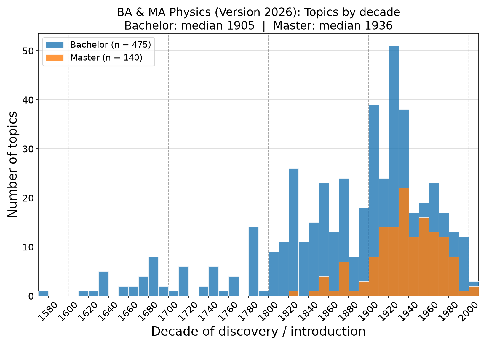

# Historical Analysis of the Physics Curriculum — University of Vienna

A quantitative, historical analysis of the **Bachelor's** and **Master's
programmes in Physics** at the University of Vienna (curriculum Version 2026).
For every topic taught in the curricula we determined the **year** in which the
underlying concept was first introduced (or the discovery made) and the
responsible **scientist(s)**, with a bibliographic **source** for each
attribution. Aggregating these dates shows how each programme is distributed
across the history of physics and mathematics.

See the full write-up in [`report/Curriculum_Analysis.pdf`](report/Curriculum_Analysis.pdf).



*Topics of the Bachelor's (blue) and Master's (orange) curricula by decade of
the underlying discovery. The Bachelor spans four centuries of foundations; the
Master concentrates on twentieth-century research physics.*

## Key results

| | Bachelor | Master |
|---|---|---|
| Dated topics | 475 | 140 |
| Median year | **1905** | **1936** |
| Range | 1572 – 2004 | 1828 – 2001 |
| Modal decade | 1920s | 1930s |

The Bachelor's programme spans more than four centuries and builds the
historical foundations of physics; the Master's programme assumes those
foundations and concentrates on twentieth-century research physics.

## Repository layout

```
tables/      Topic catalogues (xlsx): each topic with year, scientist, source
             — Bachelor and Master, in German and English
figures/     Decade histograms (PNG), German and English
code/        Python scripts that generate the figures from the tables
report/      LaTeX source and compiled PDF of the analysis
```

> The underlying curriculum documents are draft versions (Version 2026) and are
> not included in this repository.

### Tables
- `BA_Physik_Module_Themen.xlsx` / `BA_Physics_Modules_Topics.xlsx` — Bachelor (DE / EN)
- `MA_Physik_Module_Themen.xlsx` / `MA_Physics_Modules_Topics.xlsx` — Master (DE / EN)

Each workbook has a *Topics by Module* sheet (one row per atomic topic, with
module, subject area, topic, year, scientist and source) and a *Module Overview*
sheet.

## Reproducing the figures

```bash
pip install openpyxl numpy matplotlib
python3 code/make_histograms.py          # per-programme histograms (BA, MA; DE+EN)
python3 code/make_combined_histogram.py  # combined BA+MA overlay (DE+EN)
```

The scripts read the spreadsheets in `tables/` and write the PNGs into
`figures/`. The year is taken from the *Year* column; only numeric years are
used, which automatically excludes non-attributable topics and the single
ancient (Euclid) entry.

## Caveat — earliest-date bias

Each topic is dated by the **earliest** possible date (the founding of the
concept), while courses also teach the later developments of that topic. The
histograms therefore show the distribution of the *conceptual origins* of the
curriculum, not the age of the material actually presented. See the report for
details.

## License / status

The analysis is based on the **draft** Version 2026 curricula (not redistributed
here). The dating and attributions are scholarly judgements; for broad fields a
representative seminal work was chosen.
